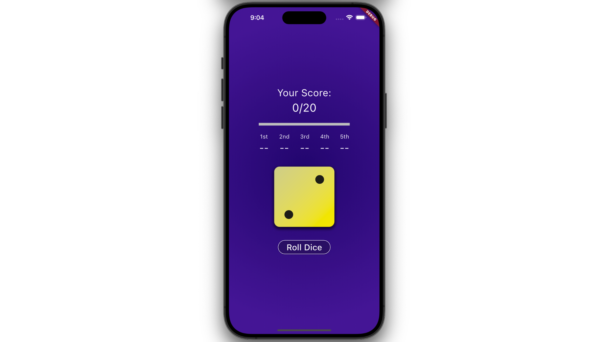
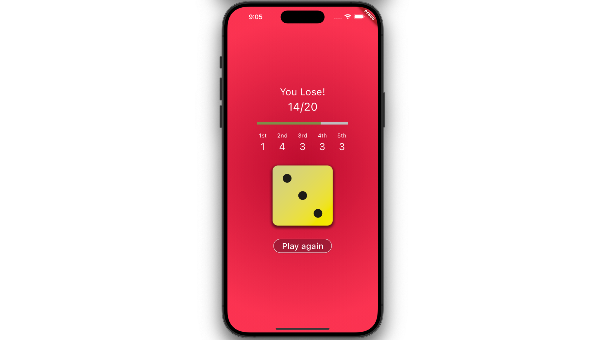
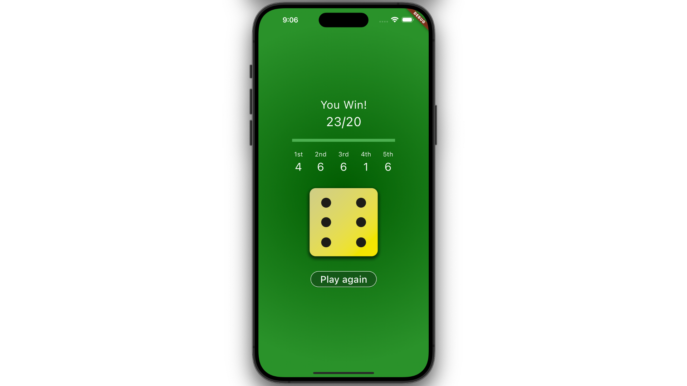

# Dice Rolling App

In this project, we'll be using Flutter and Dart to create a Dice Rolling App with a simple game.

## Features

1. Display the **score of each dice roll** in this round (display **"--"** if not completed), and show how many dice have been rolled in the current five opportunities, along with the **current total score** (for example, **Your score: 12/20**).

   

2. A **progress bar** is displayed to track the distance to the **20-points** goal.

   

3. Modify the dice roll button to display **"Play again"** at the end of each round to start the next round.

4. Upon completion (**score >= 20**), the background will change to a **green gradient**, and a **congratulations message** will be displayed (e.g., 'You win'). 

   

5. Conversely, if not completed (**score < 20**), the background will change to a **red gradient**, and a **failure message** will be displayed (e.g., 'You lose').

   

## Resources

A few introductory tutorials designed to help learn layout:
- [Table class](https://api.flutter.dev/flutter/widgets/Table-class.html)
- [LinearProgressIndicator class](https://api.flutter.dev/flutter/material/LinearProgressIndicator-class.html)