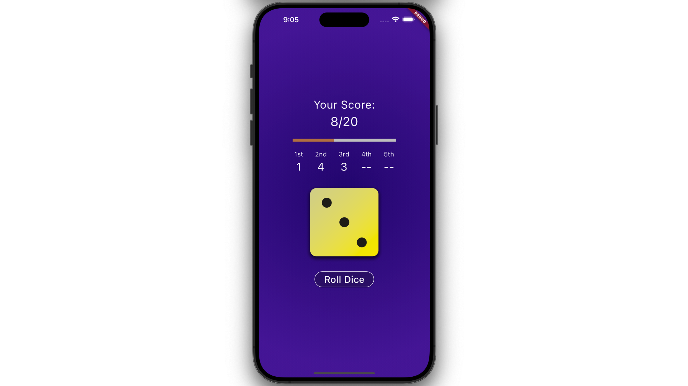

# Dice Rolling App

In this project, using Flutter and Dart to fulfill the Dice Rolling App with little game.

## Features
 
(1) Display the **score of each dice** roll in this round (display **"--"** if not completed),
 
 
and show how many dice have been rolled in the current five opportunities (for example, **Chance left: 4**),
 
 
along with the **current total score**(for example, **Your score: 3/20**).
 

   

 
(2) A **progress bar** is displayed to track the distance to the **20-points** goal.
 

   

 
Modify the dice roll button to display **"Play again"** at the end of each round to start the next round.
 

 
Upon completion (**score >= 20**), the background will change to a **green gradient**, and a **congratulations message** will be displayed (e.g., 'You win'). 
 

   

 
Conversely, if not completed(**score < 20**), the background will change to a **red gradient**, and a **failure message** will be displayed (e.g., 'You lose').
 

   

# Resources

A few introductory tutorials designed to help learn layout.
- [Table class](https://api.flutter.dev/flutter/widgets/Table-class.html)
- [LinearProgressIndicator class](https://api.flutter.dev/flutter/material/LinearProgressIndicator-class.html)